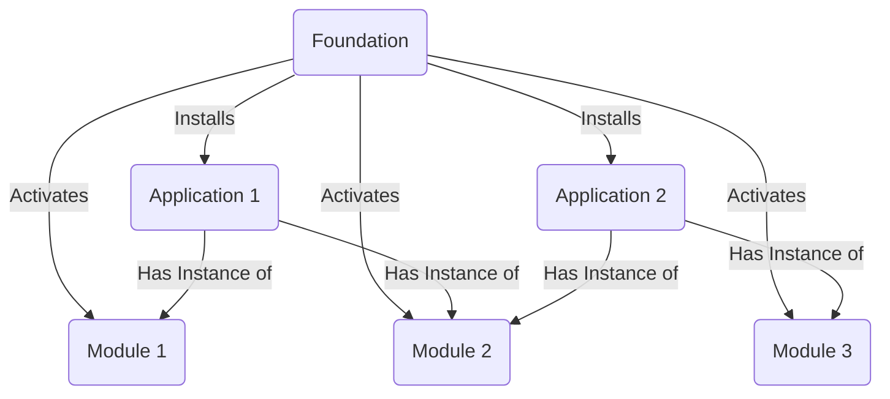

# GCP Foundation
## Objects Relationship Maps
1. All application is installed on a foundation
2. Each application could have instance of modules
3. Before module is usable in each application, they must be activated in foundation


## Quick Start
Let's using Github + GCP as an example
### Prerequisites
* Need having an available GCP Account and GitHub Account
* Using GCP Web Console or a PC with `gh`, `gcloud` and `terraform` installed.
This quick start is based on GCP Web console. 

### Configuration Steps
1. `gh repo clone $FOUNDATION_NAME && cd $FOUNDATION_NAME`
2. Running `make init-config` to initialize the configuration files
3. Running
    ```
   make init-module module_uri=xia-module-terraform-gcs/module-application-state-gcs
   make init-module module_uri=xia-module-terraform-gcs/module-application-backend-gcs
   make init-module module_uri=xia-module-gcp-project/gcp-module-project
   make init-module module_uri=xia-module-application-gh/gh-module-application   
   ```
   to adding new modules

4. Running `make activate-module module_uri=xia-module-gcp-bigquery/gcp-module-dataset` to activate creating gcp dataset in application projects

5. Running `make create-app app_name=<application_name> modules=gcp-module-dataset`

6. Running `make apply` to apply the configuration

## GCP Foundation Introduction
## Usage
### Preparation

### Initialization of modules
Initialization of the module to be used in cosmos
`make init-module module_uri=<package_name>@<version>/<module_name>"`

### Activation of modules
Activation of the module to be used in foundation
`make init-module module_uri=<package_name>@<version>/<module_name>"`
