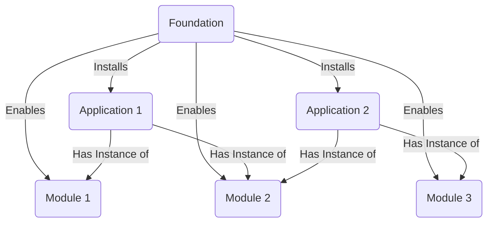

# GCP Foundation
## Objects Relationship Maps
1. All application is installed on a foundation
2. Each application could have instance of modules
3. Before module is usable in each application, they must be enabled in foundation

## GCP Foundation Introduction

## Usage
### Preparation

### Starting from scratch
make bigbang

### Foundation Operations
make create

### Module Operations
make init-module module_class=`module_class` package=`package`

### Application Operations
make create-app app_name=`application_name`
